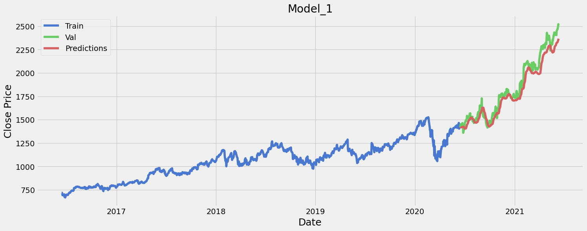
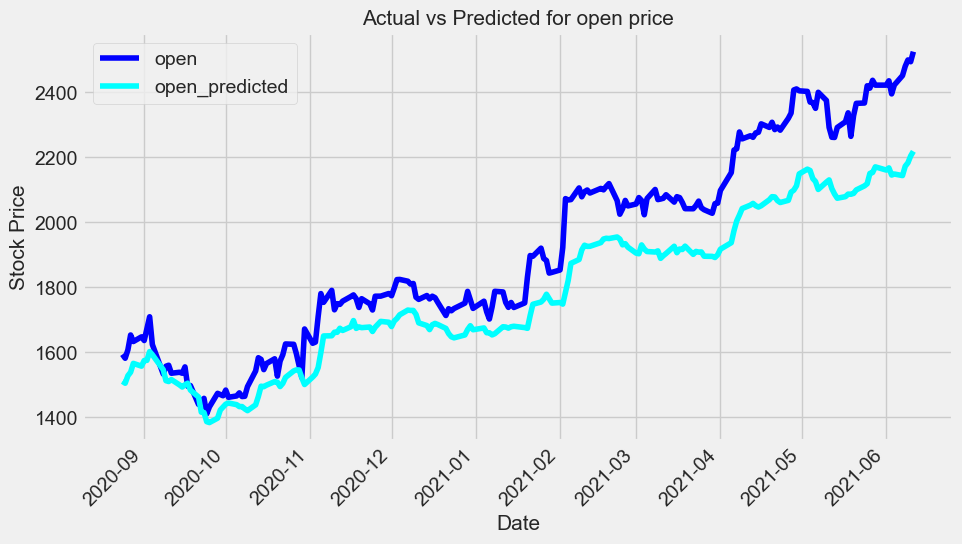

# Stock Price Prediction using LSTM and RNN

## Overview
This project aims to predict Google's stock prices using advanced machine learning techniques, specifically Long Short-Term Memory (LSTM) and Recurrent Neural Networks (RNN). The project is divided into two main Jupyter notebooks, one focusing on LSTM and the other combining RNN with LSTM methodologies.

## Datasets and Features
The datasets used in this project include historical stock price data for Google. Key features in the dataset include:
- Date
- Opening price
- Closing price
- High
- Low
- Volume of stocks traded

These features are used to understand stock price trends and make predictions.

## Methodology
### Exploratory Data Analysis (EDA)
- Data Cleaning: Removing unnecessary columns, handling missing values.
- Data Transformation: Converting data into a suitable format for analysis (e.g., formatting dates).
- Visualization: Plotting various aspects of the stock data for insights.
   - **Time Series Plot**: Displaying the stock's closing price over time, which helps in identifying the overall trend and any seasonal patterns.
   - **Volume Traded Plot**: Showcasing the volume of stocks traded over time, indicating the market activity levels.
   - **Moving Averages**: Calculating and plotting short-term and long-term moving averages to smooth out price trends and identify momentum.
   - **Price Distribution**: Using histograms and box plots to understand the distribution of stock prices and identify any outliers.
   - **Correlation Heatmap**: Analyzing the correlation between different stock attributes (like open, close, high, low) to understand their relationships.
   - **Candlestick Charts**: For more detailed analysis, showing the opening, closing, high, and low prices within specific time frames.

### LSTM Model
- The LSTM notebook focuses on building and training an LSTM model, known for its effectiveness in handling time-series data.
- Key steps include data preprocessing, model building, training, and evaluation.

### RNN & LSTM Combined Model
- The RNN notebook introduces a combined approach using both RNN and LSTM.
- This approach aims to leverage the strengths of both models to improve prediction accuracy.

## Results
- The results section should include the outcomes of the model predictions.
- Include any metrics used to evaluate the model performance (e.g., RMSE, MAE).
- Visualizations of predicted vs. actual stock prices.

## Examples
### MA Graph


### RNN Graph


### LSTM Graph


## Installation and Usage
Instructions on how to set up the project environment:
```bash
# clone the repository
git clone https://github.com/benjamin-githubprofile/StockMarketPrediction

# navigate to the project directory
cd [project-directory]

# install dependencies
pip install -r requirements.txt
